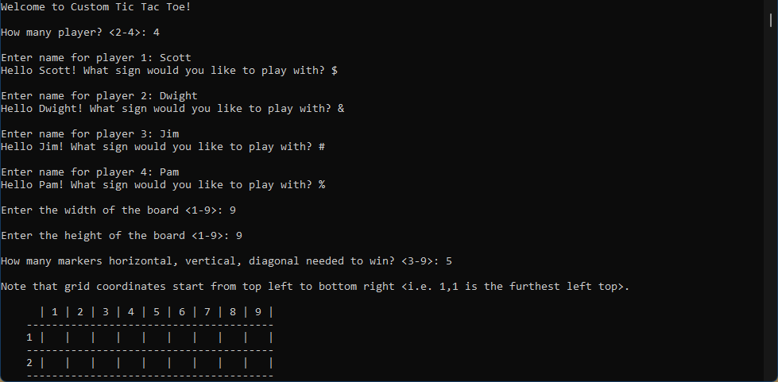
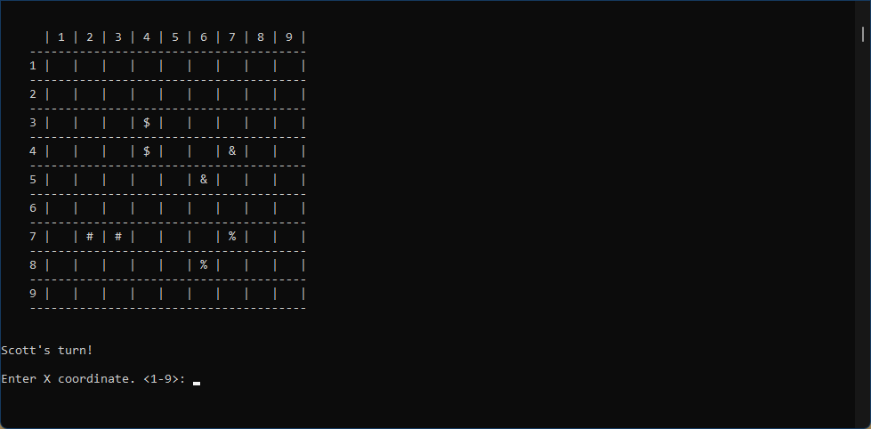

# CustomTicTacToe-cpp

A C++ OOP practice project. This tic tac toe lets upto 4 players to play in boards of any desired dimension (1 - 9 cells both horizontally and vertically). I got the idea from this [video](https://www.youtube.com/watch?v=gm2yPC65X78&list=PLSPw4ASQYyynKPY0I-QFHK0iJTjnvNUys&index=20&t=61s&ab_channel=MakingGamesWithBen).

Here are some screenshots -

